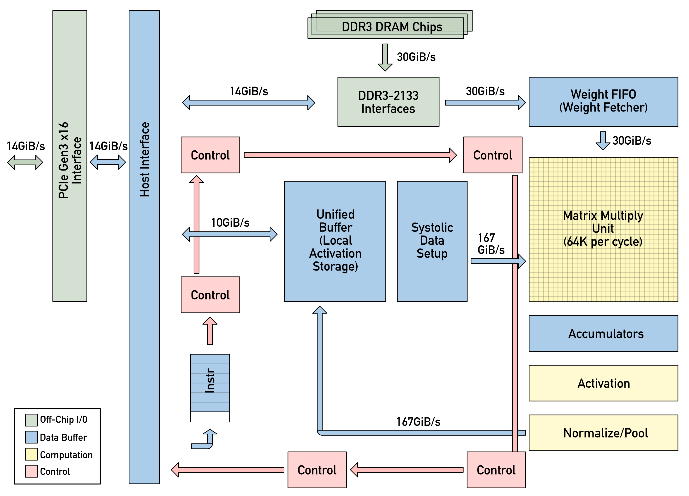
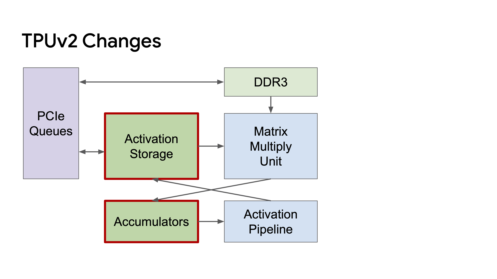
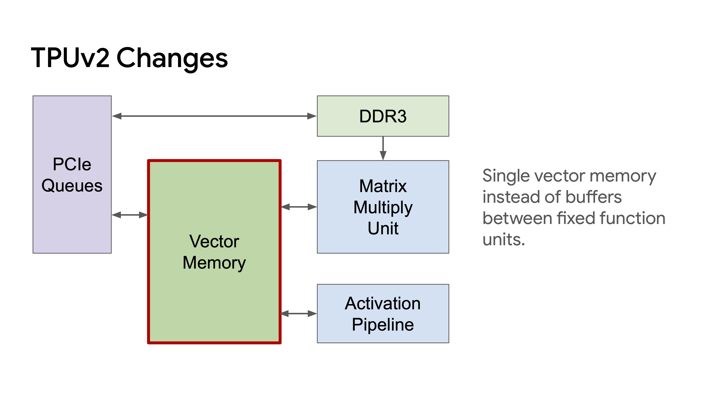
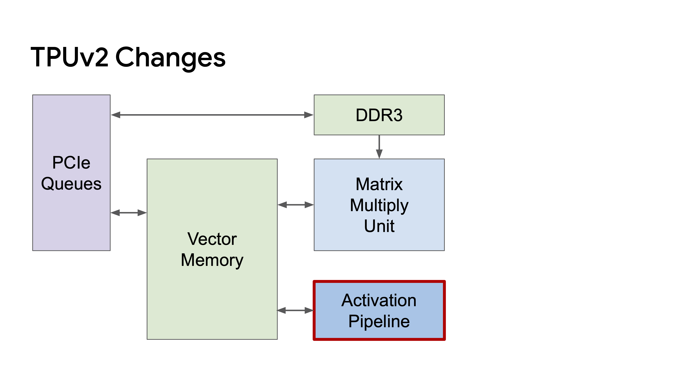
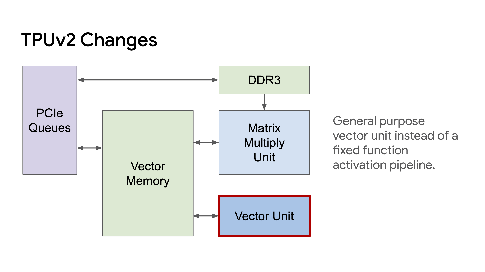
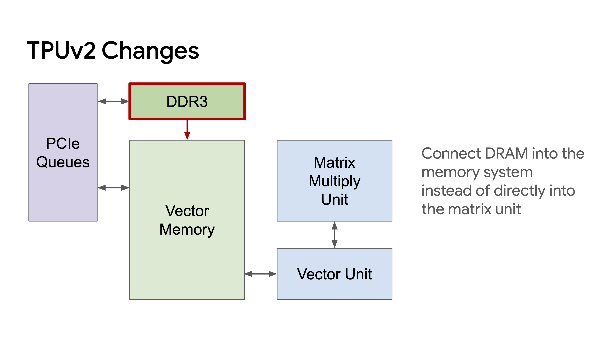
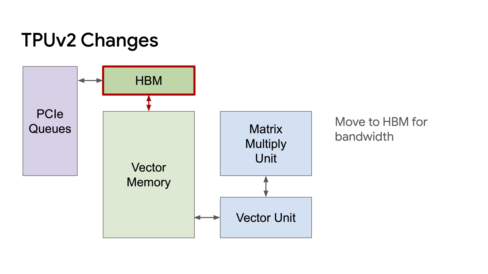
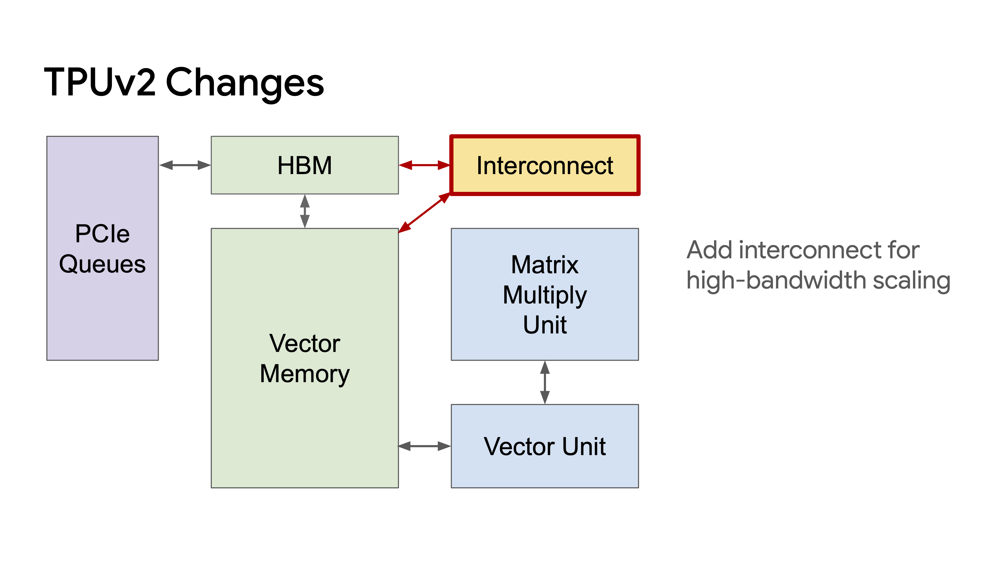

```{r setup, include=FALSE}
knitr::opts_chunk$set(echo = FALSE)
```

Google introduced TPUs in 2016. Tensor Processing Units or TPUs are Application Specific Integrated Circuits (ASICs) that are optimized for low precision, high volume matrix computations. Low precision, high volume calculations are the bedrock of NN training and the most widespread use (as well as the originally intended use) of TPUs is to accelerate neural network training and inference.

GPUs originated from the gaming community because a CPU could not handle specialised tasks such as *rasterisation, texture mapping, frame buffer operations* etc. The deep learning community adopted GPUs and has continued to use them and extend their capabilities. However, further performance gains could not be extracted via the addition of transistors alone. As a more spearheaded approach, TPUs were conceived with the idea that removing graphics capabilities and focusing on matrix multiplication capabilities could lead to better performance and power efficiency.

> As is the case with a lot of new advancements, the theoretical component needed to make this leap already existed. Work on systolic matrix multiplication had existed since the 1980s and it was put to use in TPUs. Three versions of TPUs have been released with v2 and v3 being accessible to the general public via Google Cloud.

# Background

### Systolic Architectures

Systolic architecture design is a general methodology for mapping high level computations into hardware structures developed at Carnegie Melon University around 1980.

Systolic architecture gets its name from analogising the human heart, which pumps oxygenated blood throughout the body and receives deoxygenated blood back from the organs with a computer's memory, which pumps data throughout the processing units and gets processed data back.

When the number of operations is greater than the total number of I/O elements, the task is said to be "Compute Bound". In the reverse case, the task is said to be "I/O bound".

As an example, matrix multiplication is a compute bound task while matrix addition is an I/O bound task.

The original paper on systolic architectures is fairly accessible. In case you're interested, the paper's titled *"Why Systolic Architectures?" by H.T. Kung*. (<http://www.eecs.harvard.edu/~htk/publication/1982-kung-why-systolic-architecture.pdf>)

> Systolic architectures can only speed up tasks that are compute bound.

### Roofline Graphs

Just read Patterson's article on it.

### bfloat16

This is a simple one. Lower precision arithmetic is faster. So, Google created a datatype that it calls *BFLOAT16* with 1 sign bit, 8 exponent bits and 7 significand precision bits. Surprisingly enough, Wikipedia was very informative on this.

+-----------------------------------------------------------------------------------------------+---+
| {width="504"}                   |   |
|                                                                                               |   |
| {width="264"} |   |
+-----------------------------------------------------------------------------------------------+---+

: Comparison

# The Evolution of TPUs

### TPUv1

There's a real deficit of good quality training chips. NVidia has a monopoly on these things. Seriously, try to find a chip that's powerful, natively supported by Python and not made by NVidia and the whole thing starts to look a lot like a monopoly.

NVidia V100 is \$8,799. Holy crap! That's a lot of money for a chip.

#### Architecture

{width="564"}

It looks a little intimidating at first glance but there's really only a few noteworthy things.

1.  **Bandwidth Gap** - DDR3 -\> MMU is about 30GiB/s and Systolic Data Setup-\>MMU is about 167GiB/s. That's a huge gap. When we consider how expensive retreiving something from RAM is, we start to see why we need systolic architectures.
2.  **Matrix Multiply Unit**
3.  **Common Neural Network Layers**

> *TPU v1 is manufactured on a 28 nm process with a die size ≤ 331 mm2, clock speed of 700 MHz, 28 MB of on-chip memory, 4 MB of 32-bit accumulators, and a 256×256 systolic array of 8-bit multipliers. For this reason, we can get 700Mhz\*65536 (multipliers) → 92 Tera operations/sec. TPU v1 has an 8 GB dual-channel 2133 MHz DDR3 SDRAM offering 34 GB/s of bandwidth. It has thermal design power of 28-40 Watts, which is certainly low consumption compared to GPUs and CPUs.*

I should point out that it's \~90T inference ops/s. I'm more interested in training than inference but it's insanely fast.

### TPUv2

Then Google came out with TPUv2 in 2017? Google gave a presentation at the hotchips conference and the slides do a good job of how the TPUv2 evolved from 1st gen TPUs.

|                                                                                   |                                |
|-----------------------------------------------------------------------------------|--------------------------------|
| .png){width="400"} |                                |
| {width="400"}                                                    | {width="400"} |
| {width="400"}                                                    | {width="400"} |
| {width="400"}                                                    | {width="400"} |
| {width="400"}                                                    |                                |

Now, to see the components in a little more detail, here's a little figure I created:


### So, how fast is it?

Originally, I was going to perform all experiments on TPUv3 via Google Cloud but that is such a pain! So, I decided to buy Colab Pro, and set the compute to TPU and High-Ram. PyTorch was recently modified to work on XLA devices which out TPU is. I'm proficient in PyTorch and it was fun to create these benchmarks. I'm not presenting the results until I hear from AWS about my GPU. I want to run them in a tightly controlled environment.

Here's the GitHub Repo: <https://github.com/dxgp/TPU_PyTorch.git>
